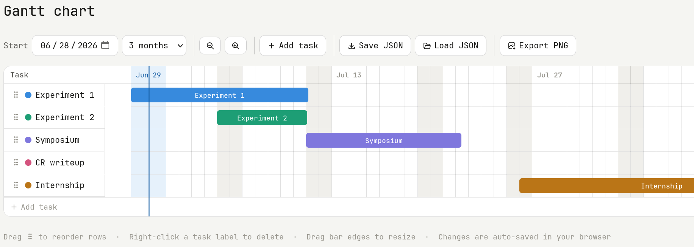

# Gantt Chart

A lightweight, interactive Gantt chart editor that runs entirely in the browser.
No installation, build tools or server are required.

Many Gantt chart applications are overly complex and impractical for quickly creating simple project plans.
I built this because I wanted a simple way to create clean, readable Gantt charts without the complexity of full project management software.
It consists of a single HTML file, works offline after the first load, and stores data locally unless you explicitly export it.



## Features

- **Drag to move** — grab any bar and slide it left or right along the timeline
- **Drag to resize** — pull the left or right edge of a bar to change its start or end date
- **Drag to reorder** — use the grip handle on the left to drag rows up or down
- **Rename tasks** — click any task name to edit it inline
- **Delete tasks** — right-click a task label and confirm
- **Color picker** — click the color dot next to a task name to change its color
- **Zoom** — use the `+` / `−` buttons to widen or narrow the day columns
- **View range** — switch between 2-week, 1-month, 2-month, and 3-month views
- **Today marker** — a vertical line marks today's date across the full chart
- **Dark mode** — automatically follows your system preference

### Saving & sharing

| Action | How |
| --- | --- |
| **Auto-save** | Every change is silently saved to your browser's local storage. Closing and reopening the tab restores your work automatically. |
| **Save JSON** | Downloads a `gantt.json` file you can share with others. |
| **Load JSON** | Loads a previously saved `gantt.json` file, restoring the chart exactly. |
| **Export PNG** | Downloads a high-resolution PNG. |

Saved charts are plain JSON and easy to read or edit by hand:

```json
{
  "version": 1,
  "baseDate": "2026-06-01",
  "days": 30,
  "cellW": 28,
  "tasks": [
    { "id": 1, "name": "Research", "start": 0, "dur": 5, "color": "#378ADD" },
    { "id": 2, "name": "Internship","start": 5, "dur": 7, "color": "#1D9E75" },
    { "id": 3, "name": "Write up", "start": 10, "dur": 14, "color": "#7F77DD" }
  ]
}
```

`start` and `dur` are in days relative to `baseDate`. You can edit this file in any text editor and reload it in the chart.

## Limitations

- No milestones
- No collaborative editing
- Data is stored locally unless exported
- No task dependencies (yet)

## Technical notes

- Single file: everything is contained in a single `index.html` file
- The Tabler icon font is loaded from jsDelivr CDN — an internet connection is required on first load. After that, the page works offline thanks to browser caching.
- Data is stored in the browser's `localStorage` (browser-local, not synced across devices)
- PNG export uses the browser's native Canvas API — no server-side rendering
- Dark mode via `prefers-color-scheme` media query

## License

MIT — do whatever you like with it.
