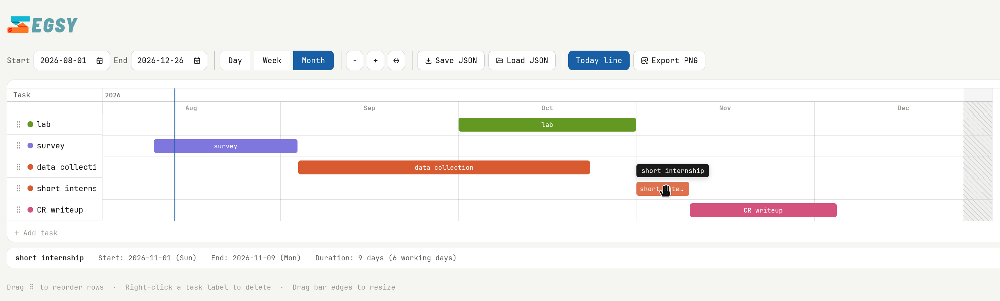

<h1 align="center" style="margin:0;">

</h1>
<h3 align="center" style="margin: 0; margin-top: 0;">
Segsy — it's either that or using Excel after it finishes its 1.9 GB update
</h3>

<p align="center">
  <a href="#features">Features</a> •
  <a href="#limitations">Limitations</a> •
<a href="#already-adopted-by-or-likely-soon-to-be-adopted-by">Adopted by</a> •
  <a href="#license">License</a>
</p>

## Overview

[Segsy](https://formerciajanitor.github.io/segsy/) is a lightweight, interactive Gantt chart editor that runs entirely in the browser,with everything contained in a single HTML file that you can download and use completely offline.
No install, no dependencies.

Many Gantt chart applications are overly complex and impractical for quickly creating simple project plans.
Rejoice! Now there is _Simple Elegant Gantt Solution for You 9000 Ultra Professional Platinum Edition Deluxe (SEGSY 9000 UPPED),_ or simply _SEGSY_.

'<a href="https://formerciajanitor.github.io/segsy/">
  
</a>

## Features

- **Drag to move, resize and reorder** — grab any bar and slide it left or right along the timeline, pull the left or right edge of a bar to change its start or end date or use the grip handle on the left to drag rows up or down
- **Rename tasks** — click any task name to edit it inline
- **Delete tasks** — right-click a task label and confirm
- **Color picker** — click the color dot next to a task name to choose from 9 predefined named colors, or select any custom color
- **Zoom** — switch between day, week or month view, zoom in/out freely, or hit fit-to-width to eliminate horizontal scrolling; each view remembers its own zoom level
- **Task info on hover** — hover a task to see its start date, end date and duration below the chart
- **Current day indicator** — toggle a vertical line marking today on the chart
- **Auto-save** — every change is silently saved to your browser's local storage, so closing and reopening the tab restores your work
- **Export as a PNG or PDF** — save your Gantt chart as a high-resolution image
- **Save/Load** — save and share a chart as a single JSON file
- **Dark mode** — automatically follows your system preference
- **Certified Y2K compliant**

### Saving & sharing

| Action | How |
| --- | --- |
| **Auto-save** | Every change is silently saved to your browser's local storage. Closing and reopening the tab restores your work automatically. |
| **Save JSON** | Downloads a `gantt.json` file that can be used to save or share the Gantt chart. |
| **Load JSON** | Loads a previously saved `gantt.json` file, restoring the chart exactly. |
| **Export PNG** | Downloads a high-resolution PNG. |

Saved charts are stored as plain JSON, making them easy to read, edit by hand or track with Git (although I am not sure why you would want to do that).

```json
{
  "version": 1,
  "baseDate": "2026-06-01",
  "days": 30,
  "cellW": 28,
  "tasks": [
    { "id": 1, "name": "Research", "start": 0, "dur": 5, "color": "#378ADD" },
    { "id": 2, "name": "Internship","start": 5, "dur": 7, "color": "#1D9E75" },
    { "id": 3, "name": "Write up", "start": 10, "dur": 14, "color": "#7F77DD" }
  ]
}
```

`start` and `dur` are in days relative to `baseDate`.

## Limitations

- No milestones
- No collaborative editing
- No task dependencies

## Already adopted by (or likely soon-to-be adopted by)

- SpaceX (Planning Division)
- Procter & Gamble
- Jackie Moon
- The Government of Paraguay
- The Czech Institute of Paleontology and Botany
- Michel from Bordeaux
- Some Microsoft employees (as an alternative to _Microsoft Project_)
- An unnamed foreign intelligence service we are not at liberty to identify
- ...and more

Please open a PR if you would like your company to be included in this list.

## License

MIT — do whatever you like with it.
